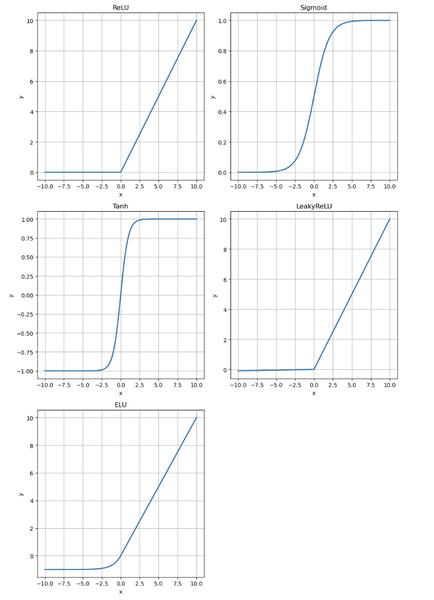

+++
title = '激活函数浅析'
date = 2025-04-15T14:16:07+08:00
draft = false
markup = 'pandoc'

+++

```python3
import torch
import matplotlib.pyplot as plt
import math

def my_relu(x):
    # ReLU: f(x) = max(0, x) torch.relu(x)
    return torch.maximum(x, torch.tensor(0.0, dtype=x.dtype, device=x.device))

def my_sigmoid(x):
    # Sigmoid: f(x) = 1 / (1 + exp(-x)) torch.sigmoid(x)
    return 1 / (1 + torch.exp(-x))

def my_tanh(x):
    # Tanh: f(x) = (exp(x) - exp(-x)) / (exp(x) + exp(-x)) torch.tanh(x)
    return (torch.exp(x) - torch.exp(-x)) / (torch.exp(x) + torch.exp(-x))

def my_leaky_relu(x, negative_slope=0.01):
    # LeakyReLU: f(x) = x if x >= 0 else negative_slope * x torch.nn.functional.leaky_relu(x, negative_slope=0.01)
    return torch.where(x >= 0, x, negative_slope * x)

def my_elu(x, alpha=1.0):
    # ELU: f(x) = x if x >= 0 else alpha*(exp(x)-1) torch.nn.functional.elu(x, alpha=1.0)
    return torch.where(x >= 0, x, alpha * (torch.exp(x) - 1))
```


$$
y = relu(x)=\max(0,x)
$$

$$
y=sigmoid(x)=\frac{1}{1 + e^{-x}}
$$

$$
y=tanh(x)=\frac{e^x-e^{-x}}{e^x+e^{-x}}
$$

$$
y=leakyRelu(x)=\begin{cases}
x  &  x > 0 \\
\alpha x &  x <= 0
\end{cases}
$$

$$
y=elu(x)=\begin{cases}
x & x > 0 \\
\alpha (e^x - 1) & x <= 0
\end{cases}
$$



